# Web Application Document - Projeto Individual - Módulo 2 - Inteli

## Nome do Projeto: Smart Room

### Autora do projeto: Ana Cristina Alves Jardim

## Sumário

1. [Introdução](#c1)  
2. [Visão Geral da Aplicação Web](#c2)  
3. [Projeto Técnico da Aplicação Web](#c3)  
4. [Desenvolvimento da Aplicação Web](#c4)  
5. [Referências](#c5)  

---

<br>

## <a name="c1"></a>1. Introdução (Semana 01)

Este projeto tem como objetivo o desenvolvimento de uma aplicação web que permite aos estudantes reservarem espaços de estudo na escola ou universidade. Por meio da plataforma, os alunos poderão visualizar as salas disponíveis, verificar os horários livres e realizar agendamentos de acordo com suas necessidades. Além de facilitar a organização da rotina de estudos, a aplicação contribui para otimizar o uso dos espaços disponíveis e promover a autonomia dos estudantes. Outro benefício importante é a redução da carga administrativa da instituição de ensino, que não precisará mais gerenciar manualmente as reservas, tornando o processo mais ágil, eficiente e automatizado.

## <a name="c2"></a>2. Visão Geral da Aplicação Web

### 2.1. Personas (Semana 01)

Este projeto é focado em um perfil principal: estudantes matriculados em uma escola ou faculdade que possua espaços de estudo que precisam ser reservados. Com o objetivo de desenvolver uma aplicação centrada na experiência do usuário final, uma persona representativa foi desenvoldida, conforme apresentado a seguir:

<div align="center">
  <sub>FIGURA 1 - Persona</sub><br>
  <br>
  <sup>Fonte: Material produzido pelos autora, 2025</sup>
</div>

A imagem do João foi gerada pelo site https://this-person-does-not-exist.com.

### 2.2. User Stories (Semana 01)

Identificação | US01
--- | ---
Persona | João Gonçalves.
User Story | "Como estudante, quero poder visualizar todas as salas disponíveis em um dia específico, para que eu possa escolher a melhor."
Critério de aceite 1 | CR1: O usuário tem acesso a um calendário da semana.
Critério de aceite 2 | CR2: O calendário possui uma lista com as salas disponíveis no dia.
Critério de aceite 3 | CR3: O usuário consegue reservar a sala que ele deseja, caso ela não tenha sido reservada ainda.

---

Como essa User Story é a mais importante do projeto, foi analisado se ela segue os critérios INVEST que são:

- **I** – Independente  
- **N** – Negociável  
- **V** – Valiosa  
- **E** – Estimável  
- **S** – Pequena (Small)  
- **T** – Testável

Essa User Story é **independente** pois descreve uma funcionalidade específica (visualizar todas as salas disponíveis para reserva) que pode ser desenvolvida e testada de forma isolada. É **negociável** pois o objetivo principal (visualizar) pode ser alcançado de diferentes maneiras, podendo ser discutidas posteriormente. É **valiosa** pois permite que o estudante possa escolher o melhor dia e a melhor sala para o que ele precisa. É **estimável** pois sabemos que envolve a integração com um calendário e com um banco de dados que informe se uma sala foi ou não reservada até o momento. É **sob medida** pois considera apenas a funcionalidade de visualizar uma sala com base em um dia específico. É **testável** pois os critérios de aceite estão bem definidos, verificando a capacidade de visualizar as salas ainda disponíveis.

---

Identificação | US02
--- | ---
Persona | João Gonçalves.
User Story | "Como estudante, quero poder escolher por quanto tempo eu quero reservar uma sala, para que eu não atrapalhe os meus colegas."
Critério de aceite 1 | CR1: O usuário deve escolher a partir de qual horário ele deseja utilizar a sala.
Critério de aceite 2 | CR2: O usuário deve informar o horário que irá liberar a sala.

---

Identificação | US03
--- | ---
Persona | João Gonçalves.
User Story | "Como estudante, quero poder reservar uma sala quando ela estiver disponível, para que eu consiga estudar"
Critério de aceite 1 | CR1: O usuário deve poder reservar uma sala, só quando ela estiver disponível.

---

Identificação | US04
--- | ---
Persona | João Gonçalves.
User Story | "Como estudante, quero poder cancelar uma reserva para que ela volte a sala possa voltar a ficar disponível para os meus colegas"
Critério de aceite 1 | CR1: A aplicação deve disponibilizar um campo para que o usuário possa cancelar uma reserva.

---

## <a name="c3"></a>3. Projeto da Aplicação Web

### 3.1. Modelagem do banco de dados  (Semana 3)

Para a modelagem do banco de dados dessa aplicação, desenvolveu-se o modelo lógico desse banco antes da criação do modelo físico. Segue abaixo o modelo lógico:

<div align="center">
  <sub>FIGURA 2 - Modelo lógico do banco de dados da aplicação</sub><br>
  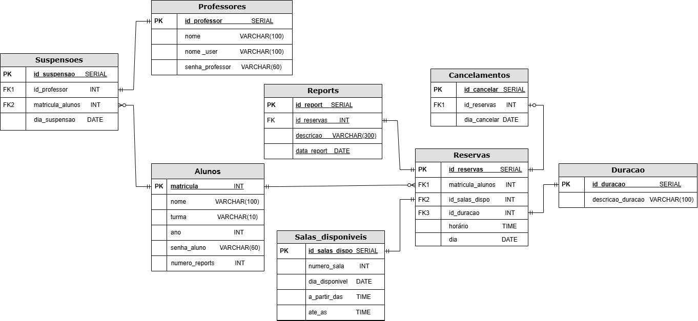<br>
  <sup>Fonte: Material produzido pela autora, 2025</sup>
</div>

Foram criadas cinco tabelas para armazenar todos os dados da aplicação, sendo elas:

#### Tabela Alunos:
Tem os atributos matricula, nome, turma, ano, email, senha_aluno. Essa entidade representa de forma abstrata os alunos de uma escola ou universidade, armazenando as informações necessárias para identificá-los e permitir que realizem login na plataforma. Um aluno pode fazer de 0 a N reservas, ou seja, a cardinalidade entre Alunos e Reservas é 0:N.

--- 

#### Tabela Salas_disponiveis:
Contém os atributos id_salas_dispo, numero_sala, dia_disponivel, a_partir_das e ate_as. Essa entidade representa os períodos em que cada sala está disponível para reserva. Cada disponibilidade pode estar vinculada a várias reservas, configurando uma cardinalidade de 1:N entre Salas_disponiveis e Reservas.

---

#### Tabela Duracao:
Contém os atributos id_duracao e descricao_duracao. Essa entidade define os tipos de duração disponíveis para uma reserva, como: 30 minutos, 1 hora, 1 hora e 30 minutos ou 2 horas. Cada tipo de duração pode ser associado a várias reservas, estabelecendo uma cardinalidade de 1:N entre Duracao e Reservas.

---

#### Tabela Cancelamentos:
Contém os atributos id_cancelar, id_reservas e dia_cancelar. Ela registra o cancelamento de uma reserva. Cada cancelamento refere-se a uma única reserva, e essa relação é opcional, portanto, a cardinalidade entre Reservas e Cancelamentos é 1:1 (opcional).

---

#### Tabela Reservas:
É a tabela central do modelo e por isso possui muitos atributos: id_reservas, matricula_alunos, id_salas_dispo, id_duracao, horário e dia. Três desses atributos são chaves estrangeiras: matricula_alunos, id_salas_dispo e id_duracao. Ela representa cada reserva feita por um aluno para uma sala em um determinado horário e dia. Além disso, cada reserva está vinculada a um único aluno, uma única sala e uma única duração.

---

### Resumo das Cardinalidades

| Tabela Origem     | Tabela Destino     | Cardinalidade |
|-------------------|--------------------|---------------|
| Alunos            | Reservas           | 0:N           |
| Salas_disponiveis | Reservas           | 1:N           |
| Duracao           | Reservas           | 1:N           |
| Reservas          | Cancelamentos      | 1:1 (opcional) |

---

O modelo físico foi implementado no arquivo init.sql, como segue abaixo:

```sql
-- Criar extensão para suportar UUIDs, se ainda não estiver ativada
CREATE EXTENSION IF NOT EXISTS "uuid-ossp";

-- Criar tabela Alunos
CREATE TABLE Alunos (
matricula INT PRIMARY KEY NOT NULL,
nome VARCHAR(100) NOT NULL,
turma VARCHAR(10) NOT NULL,
ano INT NOT NULL,
senha_aluno VARCHAR(60) NOT NULL,
numero_reports INT DEFAULT 0
);

-- Criar tabela Salas_disponiveis
CREATE TABLE Salas_disponiveis(
id_salas_dispo SERIAL PRIMARY KEY,
numero_sala INT NOT NULL,
dia_disponivel DATE NOT NULL,
a_partir_das TIME NOT NULL,
ate_as TIME NOT NULL,
CHECK (ate_as > a_partir_das)
);


-- Criar tabela Duracao
CREATE TABLE Duracao(
id_duracao SERIAL PRIMARY KEY,
descricao_duracao VARCHAR(100) NOT NULL
);

-- Adicionar os tipos de duração de reserva existentes na escola ou universidade
INSERT INTO Duracao (descricao_duracao) Values
('30 minutos'),
('1 hora'),
('1 hora e 30 minutos'),
('2 horas');

-- Criar tabela Reservas
CREATE TABLE Reservas (
id_reservas SERIAL PRIMARY KEY,
matricula_alunos INT NOT NULL,
id_salas_dispo INT NOT NULL,
id_duracao INT NOT NULL,
horario TIME NOT NULL,
dia DATE NOT NULL,
FOREIGN KEY (matricula_alunos) REFERENCES Alunos(matricula),
FOREIGN KEY (id_salas_dispo) REFERENCES Salas_Disponiveis(id_salas_dispo),
FOREIGN KEY (id_duracao) REFERENCES Duracao(id_duracao)
);

-- Criar tabela Reports
CREATE TABLE Reports (
id_report SERIAL PRIMARY KEY,
id_reservas INT NOT NULL,
descricao VARCHAR(300) NOT NULL,
data_report DATE NOT NULL,
FOREIGN KEY (id_reservas) REFERENCES Reservas(id_reservas)
);

```

### 3.1.1 BD e Models (Semana 5)
Este projeto utiliza a arquitetura MVC (Model-View-Controller), onde os arquivos da pasta models são responsáveis pela comunicação com o banco de dados. Cada Model contém funções que executam consultas SQL para manipulação e recuperação dos dados utilizados pela aplicação.

Abaixo está a descrição detalhada dos arquivos contidos na pasta models, incluindo as principais funções implementadas e suas finalidades:

#### __AlunoModel.js__

Responsável por lidar com os dados da tabela `alunos`, este arquivo possui as seguintes funções:

| Função                     | Descrição                                                                     |
|---------------------------|---------------------------------------------------------------------------------|
| `cadastrarAluno`          | Cadastra um novo aluno no banco de dados.                                      |
| `listarAlunos`            | Retorna uma lista de todos os alunos cadastrados.                              |
| `listarReservasPorAlunoId`| Lista todas as reservas feitas por um aluno específico, baseado na matrícula.  |

#### __CancelamentosModel.js__

Este módulo é responsável por lidar com os cancelamentos de reservas no sistema. Ele interage com as tabelas `cancelamentos` e `reservas` do banco de dados.

| Função               | Descrição                                                                                       |
|----------------------|-------------------------------------------------------------------------------------------------|
| `cancelarReserva`    | Insere um novo registro de cancelamento usando o `id_reservas` e define a data como o dia atual. |
| `listarCancelamentos`| Retorna uma lista de todos os cancelamentos, incluindo informações detalhadas da reserva cancelada. |

#### __LoginModel.js__

Este módulo é responsável por verificar as credenciais de login dos alunos no sistema. Para isso, ele interage com a tabela alunos do banco de dados, a fim de validar a matrícula e a senha fornecidas.

| Função            | Descrição                                                                 |
|-------------------|---------------------------------------------------------------------------|
| `verificarLogin`  | Verifica se a combinação de matrícula e senha do aluno existe no banco.  |

#### __ReservasModel.js__

Este módulo é responsável por gerenciar as operações de criação, listagem, atualização e exclusão de reservas no sistema. Ele interage com a tabela `reservas` do banco de dados.

| Função              |    Descrição                                                                                     |
|---------------------|-----------------------------------------------------------------------------------------------|
| `criarReserva`      | Insere uma nova reserva no banco de dados com as informações de aluno, sala, duração, horário e data. |
| `listarReservas`    | Retorna todas as reservas cadastradas, ordenadas por data (descendente) e horário.           |
| `atualizarReserva`  | Atualiza os dados de uma reserva específica, identificada pelo seu `id_reservas`.            |
| `excluirReserva`    | Exclui uma reserva existente com base no `id_reservas`, retornando os dados excluídos.       |

#### __Salas_disponiveisModel.js__

Este arquivo gerencia as operações relacionadas às salas disponíveis para reserva no sistema. Ele I
interage diretamente com a tabela `salas_disponiveis` no banco de dados.

| Função                  | Descrição                                                                                           |
|-------------------------|---------------------------------------------------------------------------------------------------|
| `criarSalaDisponivel`   | Insere uma nova sala disponível com número, dia e horário de disponibilidade.                      |
| `listarSalasDisponiveis`| Retorna todas as salas disponíveis, ordenadas por dia e número da sala.                           |
| `atualizarSalaDisponivel`| Atualiza os dados de uma sala disponível específica, identificada pelo `id_salas_dispo`.          |
| `excluirSalaDisponivel` | Remove uma sala disponível do banco de dados pelo seu `id_salas_dispo`.                           |

### 3.2. Arquitetura (Semana 5)

Este projeto adota a arquitetura **MVC (Model-View-Controller)** — em tradução livre, **Modelo-Visão-Controlador**. Essa arquitetura organiza o sistema em camadas bem definidas, o que facilita tanto a manutenção quanto a escalabilidade da aplicação.

A **camada Model (Modelo)** é responsável pela comunicação com o banco de dados e pela definição das regras de negócio.

A **camada Controller (Controlador)** atua como intermediária entre o Model e a View. Ela recebe as requisições HTTP, processa os dados por meio das funções definidas na camada Model e encaminha as respostas para a camada View.

Por fim, a **camada View (Visão)** é responsável pela interface com o usuário, ou seja, pela apresentação visual da aplicação. Nela ficam armazenados os arquivos HTML e CSS que definem o que é exibido ao usuário.

O diagrama a seguir ilustra a estrutura dessa arquitetura:

<div align="center">
  <sub>FIGURA 3 – Diagrama MVC</sub><br>
  <br>
  <sup>Fonte: Material produzido pela autora, 2025</sup>
</div>

Na sequência, apresenta-se um segundo diagrama que detalha a arquitetura da aplicação web desenvolvida, evidenciando os componentes criados em cada uma das camadas (Models, Controllers e Views), o Sistema de Gerenciamento de Banco de Dados (SGBD) utilizado e a ferramenta empregada para a hospedagem do banco de dados:

<div align="center">
  <sub>FIGURA 4 – Arquitetura do projeto</sub><br>
  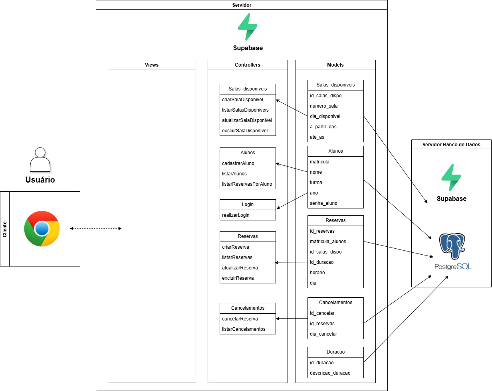<br>
  <sup>Fonte: Material produzido pela autora, 2025</sup>
</div>

### 3.3. Wireframes (Semana 03)

O wireframe é um esboço de um projeto web, seja ele um site, um aplicativo ou uma aplicação web. Ele serve para auxiliar o designer na definição da estrutura final do projeto de maneira rápida e simples. Os wireframes podem ser classificados como de baixa, média ou alta fidelidade, conforme o nível de detalhamento (MIRO, 2025). Com o objetivo de iniciar a construção da interface da aplicação, foi elaborado um wireframe de baixa fidelidade, com poucos detalhes e foco na organização estrutural, conforme apresentado a seguir:

<div align="center">
  <sub>FIGURA 5 - Wireframe de baixa fidelidade</sub><br>
  <br>
  <sup>Fonte: Material produzido pela autora, 2025</sup>
</div>
 
Para melhor visualização dos wireframes, acesse o link: [Wireframes Figma](https://www.figma.com/design/nnneG7MvcCWrjghrtlv3r7/Wireframe?node-id=0-1&t=peOSSvikLLiF2O9z-1).

Com o objetivo de facilitar o entendimento do wireframe, as telas possuem números de identificação no canto superior direito. Assim:

#### Tela 1 - Login:
Permite que o aluno realize login na plataforma, informando matrícula e senha.

#### Tela 2 - Reservas:
Exibe todas as reservas ativas do aluno e contém o botão para criação de uma nova reserva.

#### Tela 3 - Nova Reserva:
Apresenta ao usuário um calendário semanal com as salas disponíveis em cada dia, permitindo selecionar uma sala para reserva.

#### Tela 4 - Confirmação da Reserva:
Mostra um resumo da reserva com sala, dia, horário e duração, solicitando confirmação do usuário.

#### Tela 5 - Cadastro:
Caso o usuário ainda não possua cadastro, ele pode acessar esta tela a partir da tela 1. Aqui, ele informa matrícula, nome, turma, ano e senha para se cadastrar.

#### Tela 6 - Informações:
Exibida quando o usuário clica em um ícone específico na tela 2, revelando uma aba lateral com o total de reservas e cancelamentos realizados.

#### Tela 7 - Cancelamento:
Pop-up exibido quando o usuário opta por cancelar uma reserva na tela 2. Ela solicita confirmação da ação.

#### Tela 8 - Mensagem de Sucesso:
Pop-up de confirmação exibido após a confirmação do cancelamento na tela 7, informando que a reserva foi cancelada com sucesso e permitindo que o usuário volte para a tela 2.

Os wireframes foram construídos com base nas User Stories descritas na seção 2.2 desse documento, em especial, a User Story US01, que trata da visualização de salas disponíveis para reserva em um dia específico. A funcionalidade é contemplada nas seguinte tela:
- Tela 3: apresenta o calendário semanal com as salas disponíveis por dia, atendendo aos critérios CR1 e CR2.

Além disso, ao clicar em uma sala, o usuário é direcionado à tela de confirmação da reserva, onde pode selecionar o horário de início e a duração, contemplando os critérios da User Story US02. O botão “Confirmar” permite ao usuário efetivar a reserva, de acordo com o critério CR1 da User Story US03. E a opção “Cancelar” aparece junto a cada reserva realizada, sendo seguida por uma tela de confirmação e uma mensagem de sucesso, implementando o critério de aceitação da User Story US04.

Os wireframes também incluem o fluxo de autenticação do usuário (login e cadastro), garantindo que apenas alunos registrados tenham acesso à funcionalidade de reservas, respeitando a estrutura prevista no banco de dados.

Esse conjunto de telas demonstra de forma clara como as funcionalidades foram pensadas com base nas necessidades reais do usuário, garantindo que o sistema seja funcional, intuitivo e centrado no estudante.

### 3.4. Guia de estilos (Semana 05)

Este guia de estilos tem como objetivo padronizar os aspectos visuais da aplicação Smart Room, promovendo consistência, legibilidade e uma experiência de usuário intuitiva. A seguir, apresentamos os elementos visuais e os componentes de interface utilizados no projeto, juntamente com orientações sobre como acessá-los no Figma.

__Tipografia__

A fonte utilizada em toda a aplicação é a Poppins, com hierarquias bem definidas (H1 a H4) para títulos, subtítulos e textos descritivos. A escolha dessa tipografia visa transmitir uma aparência moderna e de fácil leitura.

__Paleta de Cores__

A identidade visual do sistema é construída com tons de azul predominantes:

- Azul escuro: #134A94

- Azul vibrante: #2800ED

- Azul claro: #72AAFF

Além disso, cores neutras como #D9D9D9 (cinza claro) e #FFFFFF (branco) são utilizadas para equilibrar a interface e garantir contraste e acessibilidade.

__Pop-ups e Alertas__

Utilizados para informar ou solicitar ações do usuário, seguem um padrão com fundo azul claro, ícones de ação (ex: fechar) e textos centralizados. Exemplos:

- “Verifique seu e-mail”

- “Reserva concluída”

- “Tem certeza?” (com botões de ação)

__Botões__

Seguem um estilo arredondado, com cores vibrantes (azul ou roxo) para ações primárias. Sempre com textos em caixa alta, alinhados ao centro para garantir clareza.

__Assets__

Logo: Utilizado em cabeçalhos e materiais institucionais.

<div align="center">
  <sub>FIGURA 6 - Logo Smart Room</sub><br>
  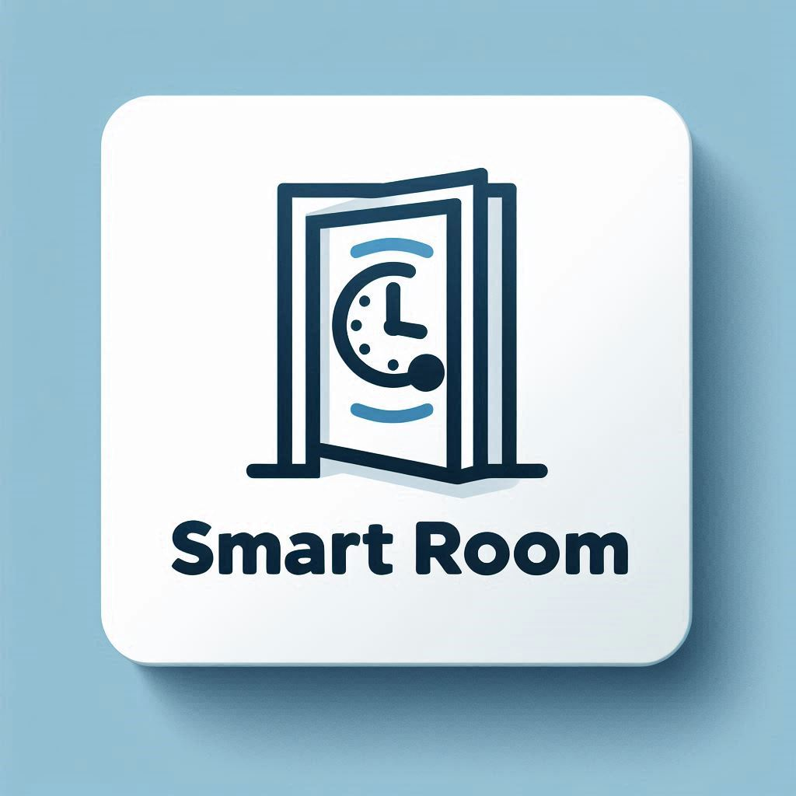<br>
  <sup>Fonte: Material produzido pela autora, 2025</sup>
</div>

Ícones: Minimalistas e monocromáticos, representando ações como adicionar, cancelar, voltar, entre outros.

<div align="center">
  <sub>FIGURA 7 - Ícones</sub><br>
  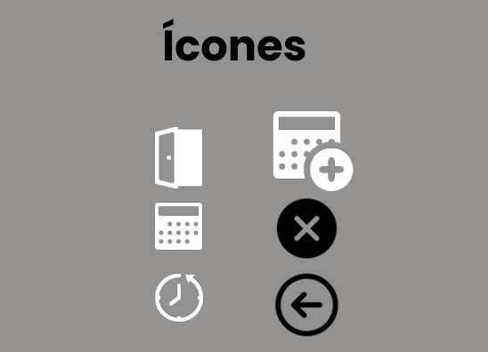<br>
  <sup>Fonte: Material produzido pela autora, 2025</sup>
</div>

Imagem de fundo: Fotografia de uma sala de aula, reforçando a identidade acadêmica do projeto.

<div align="center">
  <sub>FIGURA 8 - Imagem de Fundo</sub><br>
  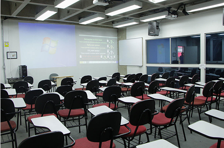<br>
  <sup>Fonte: Material produzido pela autora, 2025</sup>
</div>

__Acesso no Figma__

Para visualizar o guia de estilos diretamente no Figma:
- Acesse o link: [Smart Room](https://www.figma.com/design/nnneG7MvcCWrjghrtlv3r7/SmartRoom?node-id=98-272&t=I1Jfo7rR6IUTJgKQ-1).

- Na aba lateral esquerda, localize a página Guia de Estilos;


<div align="center">
  <sub>FIGURA 9 - Indicação da localização da página Guia de Estilos</sub><br>
  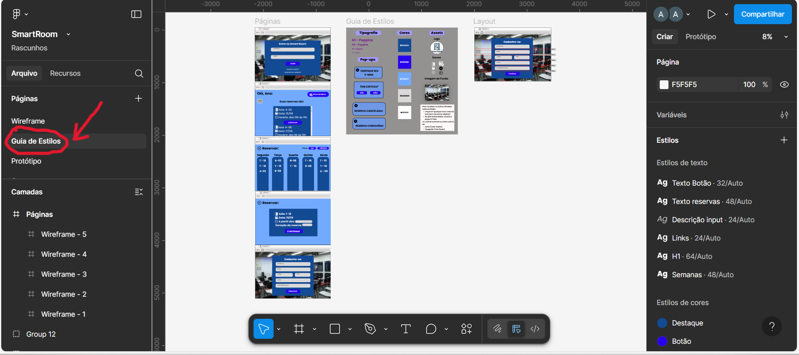<br>
  <sup>Fonte: Material produzido pela autora, 2025</sup>
</div>

O guia de estilos é uma ferramenta essencial para manter a identidade visual do Smart Room consistente ao longo de seu desenvolvimento. Ao seguir essas diretrizes, garantimos que todas as telas da aplicação estejam alinhadas com os objetivos do projeto, facilitando a colaboração entre designers, desenvolvedores e demais envolvidos na construção da solução. A padronização visual contribui diretamente para a usabilidade, acessibilidade e profissionalismo do sistema.

### 3.5. Protótipo de alta fidelidade (Semana 05)

O protótipo de alta fidelidade da aplicação Smart Room representa a versão visual mais próxima do produto final. Ele foi desenvolvido no Figma com base nas definições do guia de estilos e nas funcionalidades levantadas nas etapas anteriores do projeto. As telas a seguir simulam o funcionamento real do sistema, incluindo elementos visuais como tipografia, cores, botões, ícones e organização dos componentes. As figuras apresentadas nesta seção demonstram diferentes momentos da navegação pelo sistema, desde o acesso inicial até ações como confirmação de reserva e cancelamento. 

<div align="center">
  <sub>FIGURA 10 - Tela 1</sub><br>
  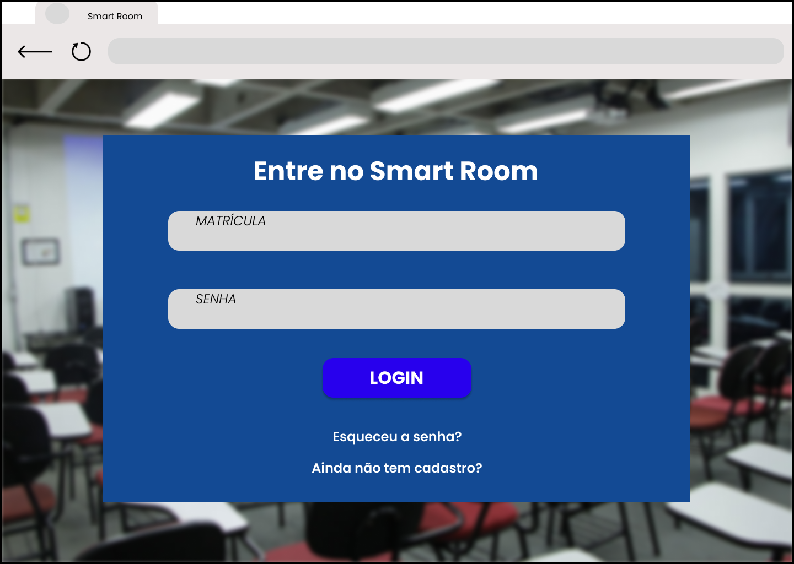<br>
  <sup>Fonte: Material produzido pela autora, 2025</sup>
</div>

<div align="center">
  <sub>FIGURA 11 - Tela 2</sub><br>
  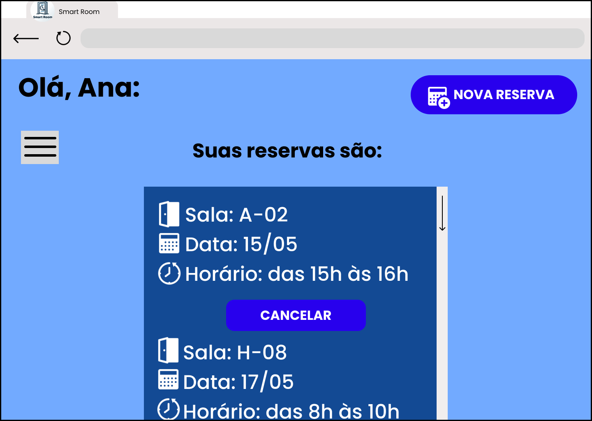<br>
  <sup>Fonte: Material produzido pela autora, 2025</sup>
</div>

<div align="center">
  <sub>FIGURA 12 - Tela 3</sub><br>
  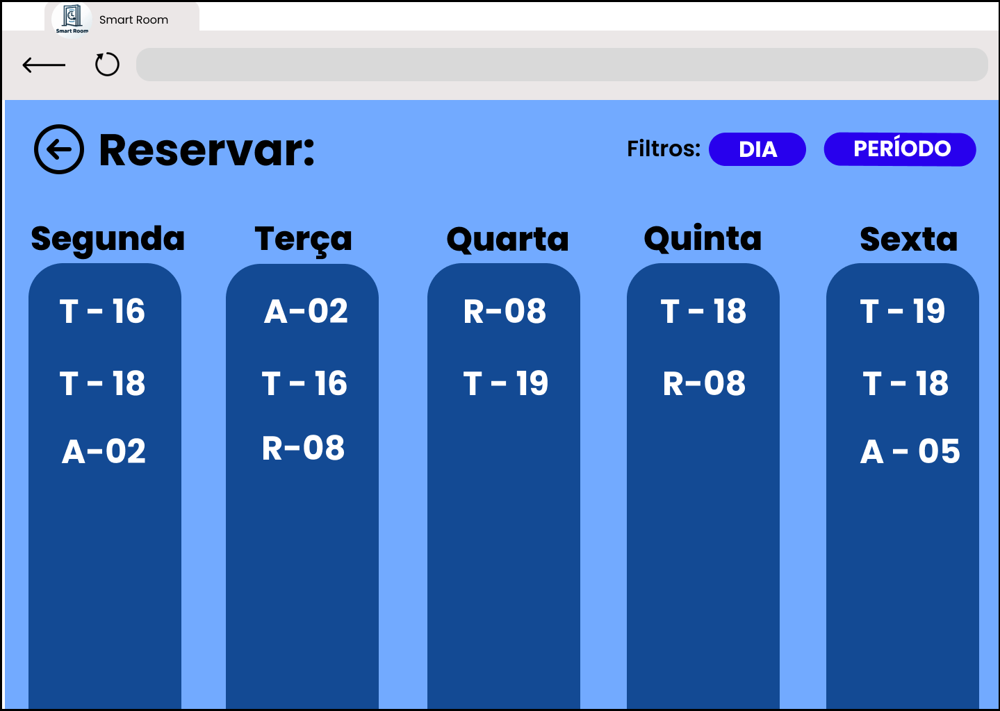<br>
  <sup>Fonte: Material produzido pela autora, 2025</sup>
</div>

<div align="center">
  <sub>FIGURA 13 - Tela 4</sub><br>
  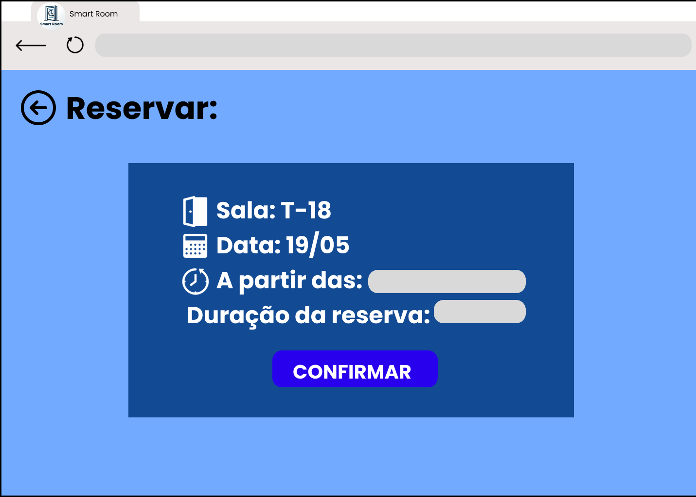<br>
  <sup>Fonte: Material produzido pela autora, 2025</sup>
</div>

<div align="center">
  <sub>FIGURA 14 - Tela 5</sub><br>
  <br>
  <sup>Fonte: Material produzido pela autora, 2025</sup>
</div>

Para acessar o protótipo interativo, basta entrar no seguinte link: [Smart Room](https://www.figma.com/design/nnneG7MvcCWrjghrtlv3r7/SmartRoom?node-id=98-272&t=I1Jfo7rR6IUTJgKQ-1).

Ao abrir a página, clique no botão Play localizado no canto superior direito da interface do Figma. Isso permitirá a navegação pelo protótipo como se estivesse utilizando o sistema real, facilitando testes de usabilidade e coleta de feedback.

<div align="center">
  <sub>FIGURA 15 - Acesse o protótipo clicando no botão de play</sub><br>
  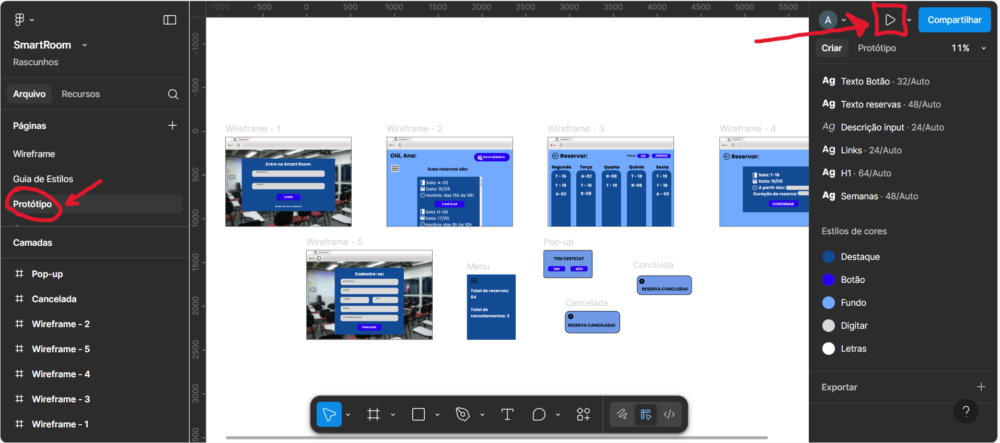<br>
  <sup>Fonte: Material produzido pela autora, 2025</sup>
</div>

O protótipo de alta fidelidade permite uma visualização clara e realista de como o Smart Room será entregue aos usuários finais. Essa etapa é essencial para identificar possíveis melhorias na interface, garantindo que a experiência do usuário seja fluida e coerente com os objetivos do projeto. A partir desse modelo, será possível avançar para a fase de desenvolvimento com maior segurança e alinhamento entre equipe e público-alvo.

### 3.6. WebAPI e endpoints (Semana 05)

A API desenvolvida para o sistema **Smart Room** segue a arquitetura RESTful e é responsável por gerenciar os dados de alunos, reservas, salas disponíveis, cancelamentos e autenticação. Abaixo estão descritos os principais endpoints organizados por módulo, incluindo o método HTTP utilizado e a função de cada rota.

#### Alunos (`/alunos`)
- `POST /alunos`  
  Cadastra um novo aluno no sistema.
- `GET /alunos`  
  Retorna a lista de todos os alunos cadastrados.
- `GET /alunos/:id/reservas`  
  Lista todas as reservas associadas a um aluno específico.

#### Reservas (`/reservas`)
- `POST /reservas`  
  Cria uma nova reserva de sala.
- `GET /reservas`  
  Lista todas as reservas registradas.
- `PUT /reservas/:id`  
  Atualiza os dados de uma reserva específica.
- `DELETE /reservas/:id`  
  Remove uma reserva existente do sistema.

#### Salas Disponíveis (`/salas`)
- `POST /salas`  
  Adiciona uma nova sala disponível ao sistema.
- `GET /salas`  
  Lista todas as salas disponíveis para reserva.
- `PUT /salas/:id`  
  Atualiza as informações de uma sala específica.
- `DELETE /salas/:id`  
  Remove uma sala do sistema.

#### Cancelamentos (`/cancelamentos`)
- `POST /cancelamentos`  
  Registra o cancelamento de uma reserva.
- `GET /cancelamentos`  
  Lista todos os cancelamentos realizados.

#### Login (`/login`)
- `POST /login`  
  Realiza a autenticação de um usuário/aluno no sistema.

---

### 3.7 Interface e Navegação (Semana 07)

*Descreva e ilustre aqui o desenvolvimento do frontend do sistema web, explicando brevemente o que foi entregue em termos de código e sistema. Utilize prints de tela para ilustrar.*

---

## <a name="c4"></a>4. Desenvolvimento da Aplicação Web (Semana 8)

### 4.1 Demonstração do Sistema Web (Semana 8)

*VIDEO: Insira o link do vídeo demonstrativo nesta seção*
*Descreva e ilustre aqui o desenvolvimento do sistema web completo, explicando brevemente o que foi entregue em termos de código e sistema. Utilize prints de tela para ilustrar.*

### 4.2 Conclusões e Trabalhos Futuros (Semana 8)

*Indique pontos fortes e pontos a melhorar de maneira geral.*
*Relacione também quaisquer outras ideias que você tenha para melhorias futuras.*

## <a name="c5"></a>5. Referências

MIRO. O que é wireframe? Disponível em: https://miro.com/pt/wireframe/o-que-e-wireframe/. Acesso em: 8 maio 2025.https://miro.com/pt/wireframe/o-que-e-wireframe/

---
