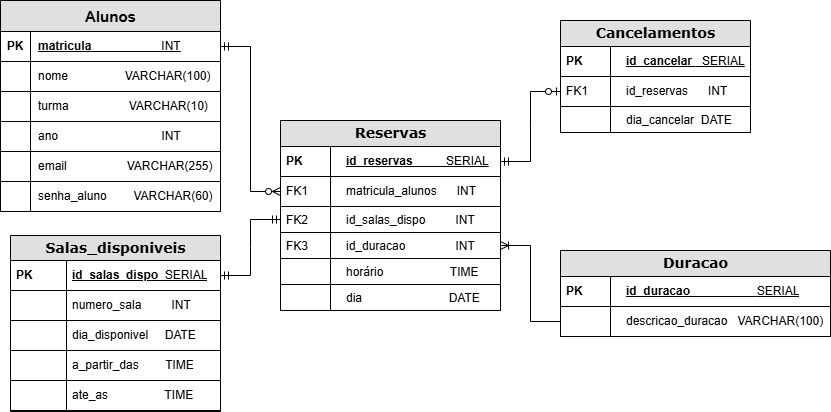

# Web Application Document - Projeto Individual - Módulo 2 - Inteli

## Nome do Projeto: Smart Room

### Autora do projeto: Ana Cristina Alves Jardim

## Sumário

1. [Introdução](#c1)  
2. [Visão Geral da Aplicação Web](#c2)  
3. [Projeto Técnico da Aplicação Web](#c3)  
4. [Desenvolvimento da Aplicação Web](#c4)  
5. [Referências](#c5)  

---

<br>

## <a name="c1"></a>1. Introdução (Semana 01)

Este projeto tem como objetivo o desenvolvimento de uma aplicação web que permite aos estudantes reservarem espaços de estudo na escola ou universidade. Por meio da plataforma, os alunos poderão visualizar as salas disponíveis, verificar os horários livres e realizar agendamentos de acordo com suas necessidades. Além de facilitar a organização da rotina de estudos, a aplicação contribui para otimizar o uso dos espaços disponíveis e promover a autonomia dos estudantes. Outro benefício importante é a redução da carga administrativa da instituição de ensino, que não precisará mais gerenciar manualmente as reservas, tornando o processo mais ágil, eficiente e automatizado.

## <a name="c2"></a>2. Visão Geral da Aplicação Web

### 2.1. Personas (Semana 01)

Este projeto é focado em um perfil principal: estudantes matriculados em uma escola ou faculdade que possua espaços de estudo que precisam ser reservados. Com o objetivo de desenvolver uma aplicação centrada na experiência do usuário final, uma persona representativa foi desenvoldida, conforme apresentado a seguir:


<br>
<p align="center" style="margin: 0; padding: 0;">
  <i><small>Legenda: A imagem do João foi gerada pelo site <a href="https://this-person-does-not-exist.com">This Person Does Not Exist</a></small></i>
</p>

### 2.2. User Stories (Semana 01)

Identificação | US01
--- | ---
Persona | João Gonçalves.
User Story | "Como estudante, quero poder visualizar todas as salas disponíveis em um dia específico, para que eu possa escolher a melhor."
Critério de aceite 1 | CR1: O usuário tem acesso a um calendário da semana.
Critério de aceite 2 | CR2: O calendário possui uma lista com as salas disponíveis no dia.
Critério de aceite 3 | CR3: O usuário consegue reservar a sala que ele deseja, caso ela não tenha sido reservada ainda.

---

Como essa User Story é a mais importante do projeto, foi analisado se ela segue os critérios INVEST que são:

- **I** – Independente  
- **N** – Negociável  
- **V** – Valiosa  
- **E** – Estimável  
- **S** – Pequena (Small)  
- **T** – Testável

Essa User Story é **independente** pois descreve uma funcionalidade específica (visualizar todas as salas disponíveis para reserva) que pode ser desenvolvida e testada de forma isolada. É **negociável** pois o objetivo principal (visualizar) pode ser alcançado de diferentes maneiras, podendo ser discutidas posteriormente. É **valiosa** pois permite que o estudante possa escolher o melhor dia e a melhor sala para o que ele precisa. É **estimável** pois sabemos que envolve a integração com um calendário e com um banco de dados que informe se uma sala foi ou não reservada até o momento. É **sob medida** pois considera apenas a funcionalidade de visualizar uma sala com base em um dia específico. É **testável** pois os critérios de aceite estão bem definidos, verificando a capacidade de visualizar as salas ainda disponíveis.

---

Identificação | US02
--- | ---
Persona | João Gonçalves.
User Story | "Como estudante, quero poder escolher por quanto tempo eu quero reservar uma sala, para que eu não atrapalhe os meus colegas."
Critério de aceite 1 | CR1: O usuário deve escolher a partir de qual horário ele deseja utilizar a sala.
Critério de aceite 2 | CR2: O usuário deve informar o horário que irá liberar a sala.

---

Identificação | US03
--- | ---
Persona | João Gonçalves.
User Story | "Como estudante, quero poder reservar uma sala quando ela estiver disponível, para que eu consiga estudar"
Critério de aceite 1 | CR1: O usuário deve poder reservar uma sala, só quando ela estiver disponível.

---

Identificação | US04
--- | ---
Persona | João Gonçalves.
User Story | "Como estudante, quero poder informar quando alguém violar o tempo de permanência em uma sala, para que a instituição possa tomar providências e essa situação não se repita"
Critério de aceite 1 | CR1: A aplicação deve disponibilizar um campo para que o usuário possa informar quando uma sala que já deveria estar disponível continua ocupada além do tempo permitido.

---

## <a name="c3"></a>3. Projeto da Aplicação Web

### 3.1. Modelagem do banco de dados  (Semana 3)

Para a modelagem do banco de dados dessa aplicação, desenvolveu-se o modelo lógico desse banco antes da criação do modelo físico. Segue abaixo o modelo lógico:



Foi necessário a criação de oito tabelas para armazenar todos os dados da aplicação, são elas:

#### Tabela Alunos:
Tem os atributos matricula, nome, turma, ano, senha_aluno e numero_reports. Essa entidade representa de forma abstrata os alunos de uma escola/universidade e guarda as informações necessárias para diferenciá-los, para que eles realizem login na plataforma e para contabilizar a quantidade de vezes que eles já foram reportados, ou seja, denunciados pro outros colegas por terem descumprido o horário de reserva. Um aluno pode fazer de 0 a N reservas

---

#### Tabela Professores:
Contém os campos id_professor, nome, nome_user e senha_professor. Ela representa os professores que podem suspender alunos no sistemae e armazena informações básicas para identificação.

--- 

#### Tabela Salas_disponiveis:
Apresenta os atributos id_salas_dispo, numero_sala, dia_disponivel, a_partir_das e ate_as. Representa os horários e dias em que as salas estão disponíveis para reserva.

---

#### Tabela Reservas:
Possui os campos id_reservas, matricula_alunos, id_salas_dispo, id_duracao, horário e dia. Essa entidade guarda os registros de reservas feitas pelos alunos para uso das salas disponíveis, indicando quem reservou qual sala, por quanto tempo e quando.

---

#### Tabela Duracao:
Apresenta os campos id_duracao e descricao_duracao. Ela armazena descrições padronizadas para diferentes durações de uso de salas, como "30 minutos", "1 hora", etc., a fim de facilitar o controle de tempo de cada reserva.

---

#### Tabela Cancelamentos:
Contém os campos id_cancelar, id_reservas e dia_cancelar. Ela armazena os registros de cancelamentos de reservas já feitas pelos alunos. Um cancelamento sempre está vinculado a uma reserva existente.

--- 

#### Tabela Reports:
Tem os atributos id_report, id_reservas, descricao e data_report. Essa tabela registra denúncias feitas por alunos em relação ao uso indevido das reservas, permitindo a inclusão de uma descrição e data do ocorrido. Cada denúncia está associada a uma reserva específica.

---

#### Tabela Suspensoes:
Possui os campos id_suspensao, id_professor, matricula_alunos e dia_suspensao. Representa as punições aplicadas por professores a alunos que descumprirem regras da plataforma, como uso indevido de salas. A suspensão está associada tanto ao professor que a aplicou quanto ao aluno penalizado.

O modelo físico foi implementado no arquivo init.sql, como segue abaixo:

```sql
-- Criar extensão para suportar UUIDs, se ainda não estiver ativada
CREATE EXTENSION IF NOT EXISTS "uuid-ossp";

-- Criar tabela Alunos
CREATE TABLE Alunos (
matricula INT PRIMARY KEY NOT NULL,
nome VARCHAR(100) NOT NULL,
turma VARCHAR(10) NOT NULL,
ano INT NOT NULL,
senha_aluno VARCHAR(60) NOT NULL,
numero_reports INT DEFAULT 0
);

-- Criar tabela Salas_disponiveis
CREATE TABLE Salas_disponiveis(
id_salas_dispo SERIAL PRIMARY KEY,
numero_sala INT NOT NULL,
dia_disponivel DATE NOT NULL,
a_partir_das TIME NOT NULL,
ate_as TIME NOT NULL,
CHECK (ate_as > a_partir_das)
);


-- Criar tabela Duracao
CREATE TABLE Duracao(
id_duracao SERIAL PRIMARY KEY,
descricao_duracao VARCHAR(100) NOT NULL
);

-- Adicionar os tipos de duração de reserva existentes na escola ou universidade
INSERT INTO Duracao (descricao_duracao) Values
('30 minutos'),
('1 hora'),
('1 hora e 30 minutos'),
('2 horas');

-- Criar tabela Reservas
CREATE TABLE Reservas (
id_reservas SERIAL PRIMARY KEY,
matricula_alunos INT NOT NULL,
id_salas_dispo INT NOT NULL,
id_duracao INT NOT NULL,
horario TIME NOT NULL,
dia DATE NOT NULL,
FOREIGN KEY (matricula_alunos) REFERENCES Alunos(matricula),
FOREIGN KEY (id_salas_dispo) REFERENCES Salas_Disponiveis(id_salas_dispo),
FOREIGN KEY (id_duracao) REFERENCES Duracao(id_duracao)
);

-- Criar tabela Reports
CREATE TABLE Reports (
id_report SERIAL PRIMARY KEY,
id_reservas INT NOT NULL,
descricao VARCHAR(300) NOT NULL,
data_report DATE NOT NULL,
FOREIGN KEY (id_reservas) REFERENCES Reservas(id_reservas)
);

-- Criar tabela Cancelamentos
CREATE TABLE Cancelamentos (
id_cancelar SERIAL PRIMARY KEY,
id_reservas INT NOT NULL,
dia_cancelar DATE NOT NULL,
FOREIGN KEY (id_reservas) REFERENCES Reservas(id_reservas)
);

-- Criar tabela Professores
CREATE TABLE Professores (
id_professor SERIAL PRIMARY KEY,
nome VARCHAR(100) NOT NULL,
nome_user VARCHAR(100) NOT NULL UNIQUE,
senha_professor VARCHAR(60) NOT NULL
);

-- Criar tabela Suspensoes
CREATE TABLE Suspensoes (
id_suspensao SERIAL PRIMARY KEY,
id_professor INT NOT NULL,
matricula_alunos INT NOT NULL,
dia_suspensao DATE NOT NULL,
FOREIGN KEY (id_professor) REFERENCES Professores(id_professor),
FOREIGN KEY (matricula_alunos) REFERENCES Alunos(matricula)
);
```

### 3.1.1 BD e Models (Semana 5)
*Descreva aqui os Models implementados no sistema web*

### 3.2. Arquitetura (Semana 5)

*Posicione aqui o diagrama de arquitetura da sua solução de aplicação web. Atualize sempre que necessário.*

**Instruções para criação do diagrama de arquitetura**  
- **Model**: A camada que lida com a lógica de negócios e interage com o banco de dados.
- **View**: A camada responsável pela interface de usuário.
- **Controller**: A camada que recebe as requisições, processa as ações e atualiza o modelo e a visualização.
  
*Adicione as setas e explicações sobre como os dados fluem entre o Model, Controller e View.*

### 3.3. Wireframes (Semana 03)

*Posicione aqui as imagens do wireframe construído para sua solução e, opcionalmente, o link para acesso (mantenha o link sempre público para visualização).*

### 3.4. Guia de estilos (Semana 05)

*Descreva aqui orientações gerais para o leitor sobre como utilizar os componentes do guia de estilos de sua solução.*


### 3.5. Protótipo de alta fidelidade (Semana 05)

*Posicione aqui algumas imagens demonstrativas de seu protótipo de alta fidelidade e o link para acesso ao protótipo completo (mantenha o link sempre público para visualização).*

### 3.6. WebAPI e endpoints (Semana 05)

*Utilize um link para outra página de documentação contendo a descrição completa de cada endpoint. Ou descreva aqui cada endpoint criado para seu sistema.*  

### 3.7 Interface e Navegação (Semana 07)

*Descreva e ilustre aqui o desenvolvimento do frontend do sistema web, explicando brevemente o que foi entregue em termos de código e sistema. Utilize prints de tela para ilustrar.*

---

## <a name="c4"></a>4. Desenvolvimento da Aplicação Web (Semana 8)

### 4.1 Demonstração do Sistema Web (Semana 8)

*VIDEO: Insira o link do vídeo demonstrativo nesta seção*
*Descreva e ilustre aqui o desenvolvimento do sistema web completo, explicando brevemente o que foi entregue em termos de código e sistema. Utilize prints de tela para ilustrar.*

### 4.2 Conclusões e Trabalhos Futuros (Semana 8)

*Indique pontos fortes e pontos a melhorar de maneira geral.*
*Relacione também quaisquer outras ideias que você tenha para melhorias futuras.*


## <a name="c5"></a>5. Referências

_Incluir as principais referências de seu projeto, para que seu parceiro possa consultar caso ele se interessar em aprofundar. Um exemplo de referência de livro e de site:_<br>

---
---